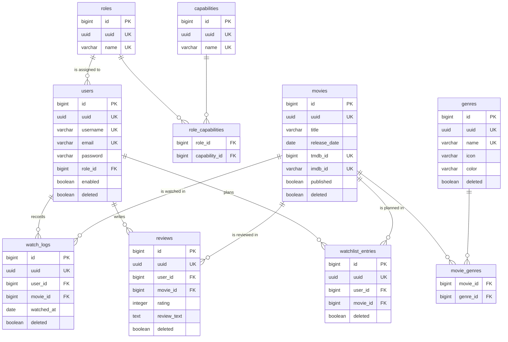

# The database

PostgreSQL 16, with the schema built entirely by Flyway migrations. The
application never creates or alters a table at runtime: `ddl-auto` is set
to `validate`, so Hibernate checks that the schema matches the entities
and refuses to start if it does not.

---

## Diagram

Only the columns that identify a row or connect it to another are shown.
Every table also carries `created_at`, `updated_at`, `deleted` and
`deleted_at`, except the two join tables, which carry nothing else.



Every unique marker above applies only to rows that have not been
deleted, which is explained further down.

---

## What is in it

Eleven tables in three groups, plus the one Flyway keeps for itself.

### Reference data

| Table | Holds |
|---|---|
| `roles` | The two roles, `USER` and `ADMIN` |
| `capabilities` | Fine grained permissions such as `MOVIE_CREATE` |
| `role_capabilities` | Which role owns which capability |

A role grants nothing by itself. Every protected endpoint asks for one
capability, and a role is simply the set it owns, which is why adding a
permission is a row rather than a code change.

### The catalogue

| Table | Holds |
|---|---|
| `movies` | Films, with their TMDB and IMDb identifiers |
| `genres` | Genres, with a colour and an icon name |
| `movie_genres` | The many to many relationship between them |

### Activity

| Table | Holds |
|---|---|
| `users` | Accounts |
| `watch_logs` | One row per viewing, so a rewatch is a second row |
| `reviews` | At most one active review per user and film |
| `watchlist_entries` | At most one active entry per user and film |

---

## Rules the database enforces itself

Business rules live in the service layer, but the ones that must never be
broken are also written into the schema. A rule enforced only in code
holds until somebody writes a script.

### Nothing is really deleted

Every table carries `deleted` and `deleted_at`. Removing a record sets the
flag, and restoring it clears it. That keeps reviews and viewings intact
when a film is withdrawn from the catalogue, and it makes an accidental
deletion recoverable.

### Uniqueness applies to living rows only

```sql
CREATE UNIQUE INDEX uq_reviews_user_movie_active
    ON reviews (user_id, movie_id)
    WHERE deleted = FALSE;
```

Seven indexes are written this way:

```
uq_users_username_lower                uq_movies_tmdb_id_active
uq_users_email_lower                   uq_movies_imdb_id_active
uq_genres_name_active                  uq_reviews_user_movie_active
uq_watchlist_entries_user_movie_active
```

Without the condition, a deleted row would hold its name for ever: a
removed account would block that address from being registered again, and
a film taken off a watchlist could never be added back. The two user
indexes also compare in lower case, so `Emma` and `emma` cannot both exist.

### Content rules

```sql
CONSTRAINT chk_reviews_content
    CHECK (rating IS NOT NULL
           OR NULLIF(BTRIM(review_text), '') IS NOT NULL)
```

A review must say something: a score, some words, or both. Three further
checks keep a rating between 1 and 10, and reject a runtime or a TMDB
identifier that is not positive.

---

## What happens when a parent disappears

Every foreign key from activity to its subject cascades:

```
watch_logs        → users, movies       ON DELETE CASCADE
reviews           → users, movies       ON DELETE CASCADE
watchlist_entries → users, movies       ON DELETE CASCADE
movie_genres      → movies, genres      ON DELETE CASCADE
role_capabilities → roles, capabilities ON DELETE CASCADE
```

In practice this rarely fires, because records are soft deleted rather
than removed. It matters in the one place where a real deletion exists:
destroying a genre that has already been withdrawn also removes its links
to films, and nothing is left pointing at a row that is gone.

One key deliberately does not cascade:

```
users → roles                           NO ACTION
```

A role that some account still holds cannot be deleted. Cascading there
would delete the accounts along with the role, and even failing quietly
would be wrong: the authorisation model is the last thing that should
disappear by accident.

---

## Migrations

| Location | Contents | Loaded in |
|---|---|---|
| `db/migration` | Schema, roles, capabilities, assignments | every profile |
| `db/demo` | Accounts, films, genres and activity for demonstration | `dev` only |

Reference data the application cannot work without belongs to the main
chain. Demonstration data does not, because it creates accounts whose
passwords are published in this repository.

Demo migrations use version `V901` and above so they can never collide
with future schema changes. A new schema migration therefore carries a
lower version than demo data that has already run, which is why out of
order migrations are enabled in the development profile.

An applied migration is never edited. Flyway records a checksum of each
one, and changing a file that has already run makes the next startup fail
rather than leave two databases quietly different. A correction is always
a new migration.